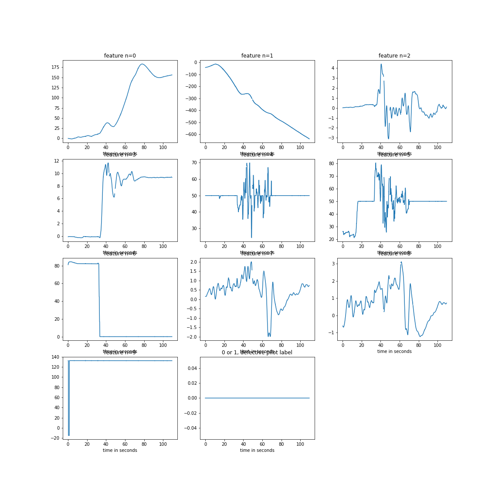
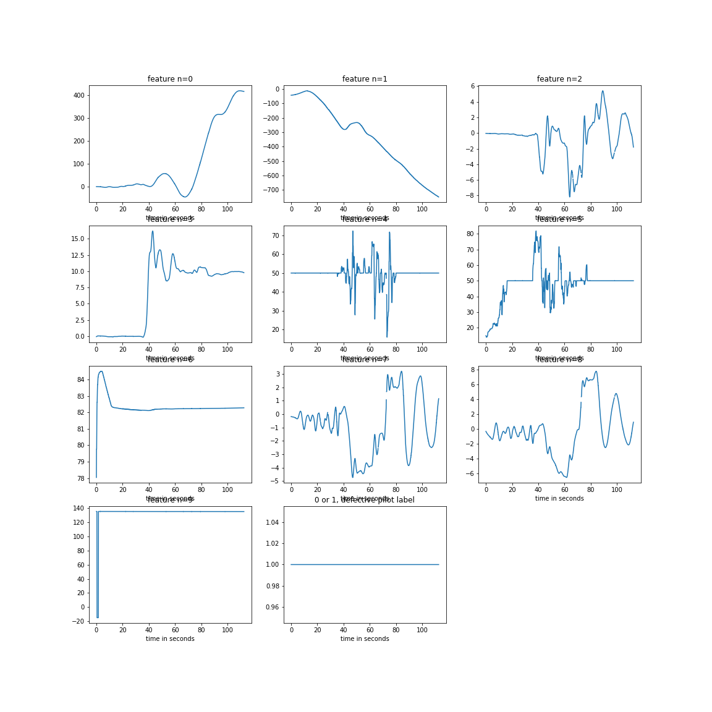

# defective_pilot

## Outline of the problem
After a tragic incident where a pilot commited suicide on the job, we want to detect psychologically unstable / defective pilots. The data-set we are working with is as follows: pilots need training every 6 months. To do this they do a flight simulation and data is gathered on them during the test flight (acceleration, velocity, etc.), we are not told exactly what the data is, only that this data is collected at a rate of 10Hz; a supervisor watches the pilot and writes 0 if the pilot is doing fine, writes 1 if the pilot is stressed or worried or something. We are sure that the 1's are defective. However, we are unsure of the accuracy of the 0's, as the instructor could have forgotten to label it as a 1.

We want to use the data to see if the pilot is defective (aka, label = 1), and identify the ones that are suspicious (labelled as 0's but could be in fact 1's).

## Ideas and Brainstorming

Cluster the 1's, centered at some point --- centroid, make balls around until it covers 90% of data, closer to centroid of 0's should be lesser weight of label on the supervised learning
then use RNN ? 2 enboxed lstm's.

## Preprocessing
We cleaned up the data so it would easier to process. For instance, some of the test runs in the CSV files were too quite short compared to the others, and so we decided to drop all the runs with under 600 data points, which corresponds to one minute of flight simulation. Moreover, we normalized the data and got rid of outliers. This amounts to roughtly 13% of the data. Note that we decided to chop off the data to 60 seconds length because of the time limit that we had, we tried to keep it as simple as possible to spend more time on the architecture of our model. However, in real life, it would be better to keep as much information as possible to process, so we get higher accuracy.

## Original features

## Our approach
### Weeding out the bad data
#### Extracting some features

The first approach taken was to construct an LSTM looking at rolling non-overlapping sequences of 5 seconds, for the first 60 seconds of every pilot. After cleaning up the data, we had 410 usable pilots' data's, each of 600 datapoints (for 60 seconds). The structure of the LSTM was simple, only one layer, 1 batch corresponding to the entire 60s of each pilot. Since we were aware that the 1's have a higher confidence score, if it was a non-defective pilot, we would have 2 epochs of training, otherwise we would keep it at 1 epoch. The reason for such a choice is that it would give us a baseline with which we could compare the performance of our other models. Furthermore, if using a unsupervised model, we could identify the pilots that are 'suspicious', we could lower the confidence level of their labels in the training of the supervised LSTM, which should be able to give a good accuracy and F1 score. The best results we've got from that LSTM was a F1 score of 0.675 and accuracy of 73%. 

Since we know the data is mislabelled with an unknown probability, we decided to try unsupervised learning to 

Mean, Standard deviation, Max, Min, double derivative mean, number of non-zero gradients 3D only for 4-5-6, mean gradient when grad is non-zero - 2D only for 4 & 5, How many times the gradient changes sign

### ML

## Solution
We will cut up the data (down-sample).

# References
[https://en.wikipedia.org/wiki/Autoregressive_integrated_moving_average ](ARIMA wikipedia)

# Figures

